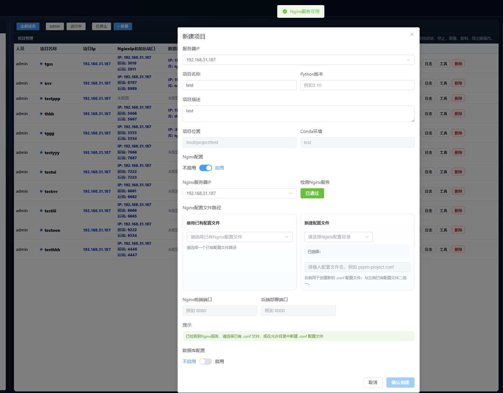
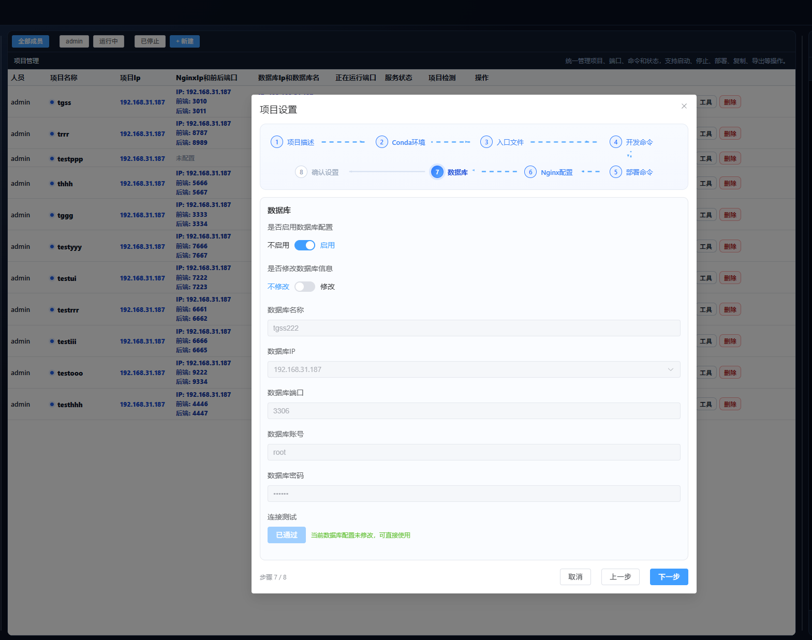
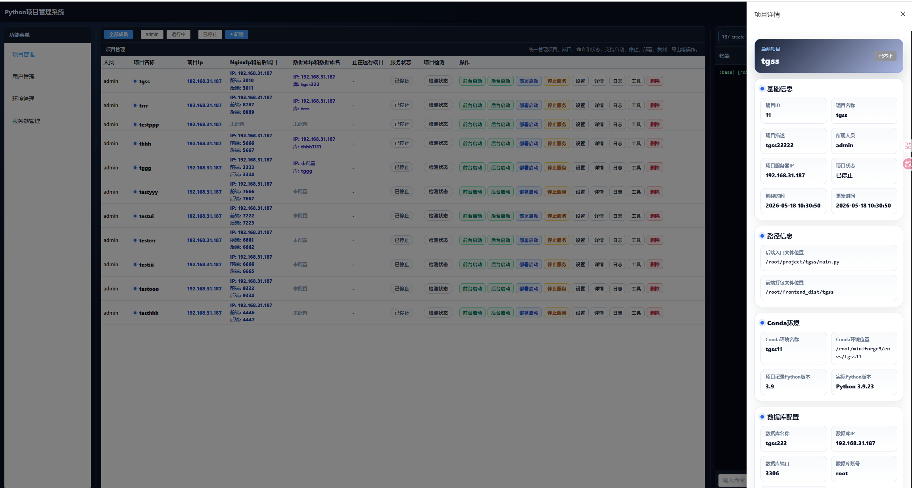
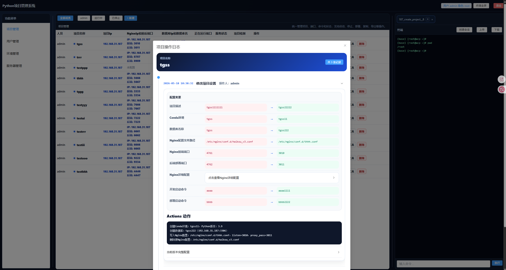

# Python 项目管理系统 · Frontend

Python 项目管理系统是一套面向个人开发者和 Python 团队的服务器项目管理与自动化运维工具。前端负责提供统一的 Web 控制台，将项目列表、项目创建、配置工作流、运行控制、详情查看、日志追踪和终端操作组织在同一个界面中。

它适合用来管理分散在多台服务器上的 Python 项目，降低重复的命令行操作成本，让项目目录、Conda 环境、数据库、Nginx 配置和服务状态都能在页面中集中维护。

## 界面预览

### 新建项目

新建项目弹框支持选择服务器、填写项目名称和 Python 版本，自动生成项目路径和 Conda 环境名称。可按需启用 Nginx 配置和数据库配置，并在提交前完成必要检测。



### 项目设置工作流

设置弹框采用步骤化工作流，覆盖项目描述、Conda 环境、入口文件、开发命令、部署命令、Nginx 配置、数据库配置和最终确认。每一步都围绕真实运维动作设计，减少误操作。



### 项目详情

详情侧边栏会集中展示项目基础信息、路径信息、Conda 环境、数据库配置、Nginx 配置、运行状态等信息，便于快速确认项目当前配置。



### 操作日志

日志弹框记录项目创建、设置变更、资源调整等关键操作，并以时间线方式展示配置变化和执行动作，方便回溯问题。



## 已实现功能

- 项目管理列表：展示人员、项目名称、项目 IP、Nginx 端口、数据库信息、运行端口、服务状态和项目检测。
- 新建项目：支持真实创建项目目录、Conda 环境、可选数据库和可选 Nginx 配置。
- 项目设置：支持项目描述、Conda 环境、入口文件、启动命令、Nginx、数据库等配置更新。
- 启动与停止：支持前台启动、后台启动、部署启动和停止服务。
- 状态检测：支持项目健康检测、服务状态检测和运行端口刷新。
- 详情与日志：支持查看完整项目详情和操作时间线。
- 删除项目：支持按范围删除项目、Conda 环境、数据库和 Nginx 配置。
- 终端区域：支持会话创建、命令执行、自动补全、清屏和历史滚动。
- 三分屏布局：菜单、项目列表、终端区域可协同工作，适合边看状态边执行命令。

## 技术栈

- Vue 3
- Vite
- Pinia
- Vue Router
- Element Plus
- Axios
- Sass

## 本地开发

```bash
npm install
npm run dev
```

默认 API 地址可通过环境变量覆盖：

```bash
VITE_API_BASE_URL=http://127.0.0.1:8888/api npm run dev
```

Windows PowerShell：

```powershell
$env:VITE_API_BASE_URL="http://127.0.0.1:8888/api"
npm run dev
```

## 构建

```bash
npm run build
```

构建产物位于 `dist/`。

## 后端仓库

```text
https://github.com/Linwangithub/python_project_management
```

## License

Apache License 2.0
